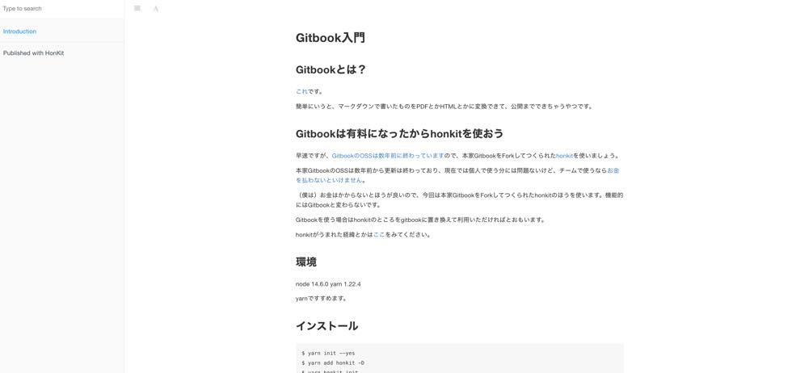

# Gitbook入門

## Gitbookとは？

[これ](https://www.gitbook.com/)です。

簡単にいうと、マークダウンで書いたものをPDFとかHTMLとかに変換できて、公開までできちゃうやつです。

## Gitbookは有料になったからhonkitを使おう

早速ですが、[GitbookのOSSは数年前に終わっています](https://github.com/GitbookIO/gitbook-cli)ので、本家GitbookをForkしてつくられた[honkit](https://github.com/honkit/honkit)を使いましょう。

本家GitbookのOSSは数年前から更新は終わっており、現在では個人で使う分には問題ないけど、チームで使うなら[お金を払わないといけません](https://www.gitbook.com/pricing)。

（僕は）お金はかからないとほうが良いので、今回は本家GitbookをForkしてつくられたhonkitのほうを使います。機能的にはGitbookと変わらないです。

Gitbookを使う場合はhonkitのところをgitbookに置き換えて利用いただければとおもいます。

honkitがうまれた経緯とかは[ここ](https://efcl.info/2020/06/19/githon/)をみてください。

## 環境

node 14.6.0
yarn 1.22.4

yarnですすめます。

## インストール

```
$ yarn init --yes
$ yarn add honkit -D
$ yarn honkit init
```

.gitignoreは下のものを使ってください

```
# Node rules:
## Grunt intermediate storage (http://gruntjs.com/creating-plugins#storing-task-files)
.grunt

## Dependency directory
## Commenting this out is preferred by some people, see
## https://docs.npmjs.com/misc/faq#should-i-check-my-node_modules-folder-into-git
node_modules

# Book build output
_book

# eBook build output
*.epub
*.mobi
*.pdf
```

## 使い方

まずはヘルプで何ができるのかみてみましょう。

```
$ yarn honkit help
```

```
Usage: honkit [options] [command]

Options:
  -V, --version                    output the version number
  -h, --help                       display help for command

Commands:
  build [options] [book] [output]  build a book
  serve [options] [book] [output]  serve the book as a website for testing
  parse [options] [book]           parse and print debug information about a book
  init [options] [book]            setup and create files for chapters
  pdf [options] [book] [output]    build a book into an ebook file
  epub [options] [book] [output]   build a book into an ebook file
  mobi [options] [book] [output]   build a book into an ebook file
  help [command]                   display help for command
```

いまいち何ができるのかわかりません。なので、本家Gitbookのコマンドをみてみます。

```
    build [book] [output]       build a book
        --log                   Minimum log level to display (Default is info; Values are debug, info, warn, error, disabled)
        --format                Format to build to (Default is website; Values are website, json, ebook)
        --[no-]timing           Print timing debug information (Default is false)

    serve [book] [output]       serve the book as a website for testing
        --port                  Port for server to listen on (Default is 4000)
        --lrport                Port for livereload server to listen on (Default is 35729)
        --[no-]watch            Enable file watcher and live reloading (Default is true)
        --[no-]live             Enable live reloading (Default is true)
        --[no-]open             Enable opening book in browser (Default is false)
        --browser               Specify browser for opening book (Default is )
        --log                   Minimum log level to display (Default is info; Values are debug, info, warn, error, disabled)
        --format                Format to build to (Default is website; Values are website, json, ebook)

    install [book]              install all plugins dependencies
        --log                   Minimum log level to display (Default is info; Values are debug, info, warn, error, disabled)

    parse [book]                parse and print debug information about a book
        --log                   Minimum log level to display (Default is info; Values are debug, info, warn, error, disabled)

    init [book]                 setup and create files for chapters
        --log                   Minimum log level to display (Default is info; Values are debug, info, warn, error, disabled)

    pdf [book] [output]         build a book into an ebook file
        --log                   Minimum log level to display (Default is info; Values are debug, info, warn, error, disabled)

    epub [book] [output]        build a book into an ebook file
        --log                   Minimum log level to display (Default is info; Values are debug, info, warn, error, disabled)

    mobi [book] [output]        build a book into an ebook file
        --log                   Minimum log level to display (Default is info; Values are debug, info, warn, error, disabled)
```

serveのコマンドで開発環境を立ち上げることができるようです。

```
$ yarn honkit serve
```

こんな感じの画面が立ち上がればOKです。




はじめにREADME.mdとSUMMARY.mdができると思いますが、README.mdがトップページ。SUMMARYは画面左の目次です。

その他のページを追加したいときは都度マークダウンファイルをつくればよいです。

画像を挿入したいときはimages的なフォルダを作って画像までのパスを相対パスで繋ぐとよいです。

公開するためのビルドファイルを生成する場合は

```
$ yarn honkit build
```

のコマンドを使うと `_book` ディレクトリができると思うので、それを公開してください。

## ドキュメント

[公式ドキュメント](https://honkit.netlify.app/)がしっかりしてるので、困ったら見ると解決する。


## おしまい
